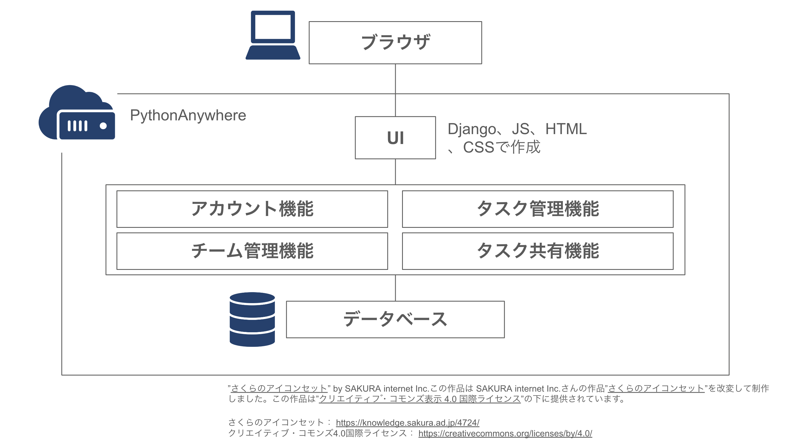

# Django_Task_Manager

##　概要
Djangoを使用したタスク管理システムです。
PythonAnywhereにデプロイしました。

## 作成した機能
- タスク・サブタスク管理(追加・編集)
- タスク・サブタスクのガンチャート表示
- タスク進捗度のグラフ表示
- アカウント機能(ログイン・サインアップ)
- チーム管理(作成・編集)
- タスク共有表示機能

## システム構成図
  